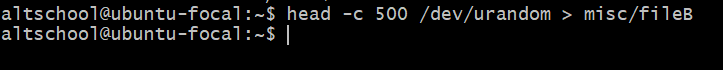
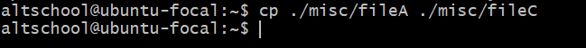
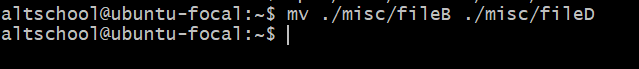
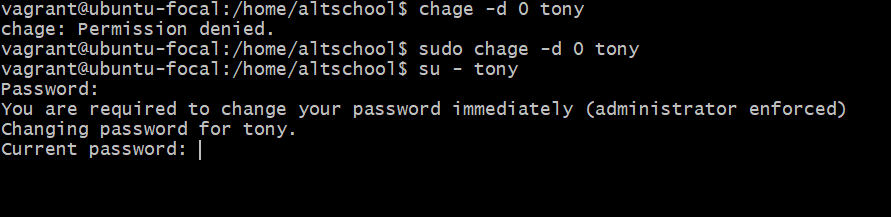
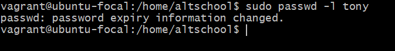
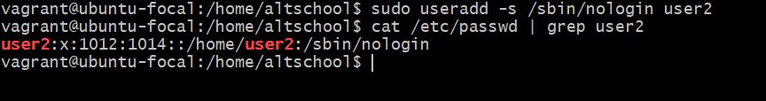

## Assignment Solution

### Prerequisite

i. Create a login user: `sudo adduser  altschool`

ii. login to the altschool user home directory `su - altschool`

iii. Create the requested directories (_code, tests, personal and misc_): `mkdir code tests personal misc`

### Solution to task a-m

| Task  | Task description | Solution | Images |
|-------|------------------|------------|------|
|a      | Change to the tests directory using absolute pathname | `cd /home/altschool/tests` |  |
|b      | Change to the tests directory from your home directory using relative pathname | `cd ./test` |  |
|c      | Use echo command to create a file named fileA with text content ‘Hello A’ in the misc directory | `echo "Hello A" > /home/altschool/misc/fileA` |  |
|d      | Create an empty file named fileB and populate it with dummy contents |create empty `touch fileB` then populate `head -c 720 /dev/urandom ./misc/fileB` |  |
|e      | Copy contents of fileA into fileC               | `cp ./misc/fileA ./misc/fileC` |  |
|f      | Move contents of fileB into fileD | `mv ./misc/fileB ./misc/fileD`  |  |
|g      | Create a tar archive called misc.tar for the contents of the misc directory | `tar -cf misc.tar misc` |  |
|h      | Compress the tar archive to create a misc.tar.gz file | `gzip misc.tar` |  |
|i      | Create a user and force the user to change his password upon login | first of create a user with `sudo adduser user1` then force user to change password with `sudo chage -d 0 user1` |  |
|j      | Lock a users password | `sudo passwd -l user1` |  |
|k      | Create a user with no login shell | `sudo useradd -s /sbin/nologin user2` |  |
|l      | Disable password based authentication for ssh | `sudo vi /etc/ssh/sshd_config` and  insert `PasswordAuthentication no` |  |
|m      | Disable root login for ssh | `sudo vi /etc/ssh/sshd_config` and set `PermitRootLogin no`  |  |
